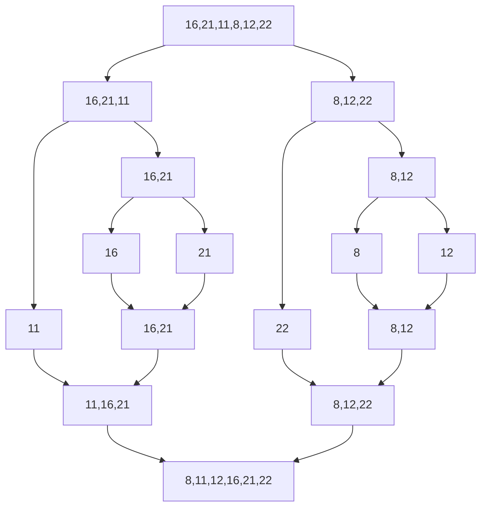

# Merge-Sort-Projesi
## [16,21,11,8,12,22] -> Merge Sort

- Yukarıdaki dizinin sort türüne göre aşamalarını yazınız.

```mermaid
graph TD;
    A[16,21,11,8,12,22]-->B[16,21,11];
    A-->C[8,12,22];
    B-->D[16,21];
    B-->E[11];
    C-->F[8,12];
    C-->G[22];
    D-->H[16];
    D-->I[21];
    F-->J[8];
    F-->K[12];
    H-->L[16,21];
    I-->L[16,21];
    E[11]-->M[11,16,21];
    L[16,21]-->M[11,16,21];
    J-->N[8,12];
    K-->N[8,12];
    G-->P[8,12,22];
    N[8,12]-->P[8,12,22];
    M[11,16,21]-->R[8,11,12,16,21,22];
    P[8,12,22]-->R[8,11,12,16,21,22];
    
```
**Big-O notation: O(n * log n)**
